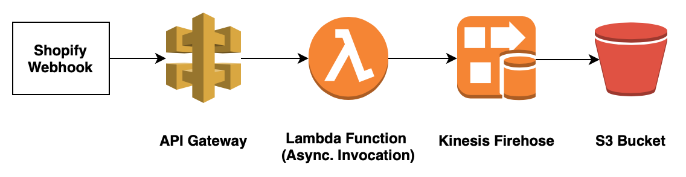

# Shopify Data Lake

An AWS SAM application that allows you to capture Shopify cart and checkout events via webhooks, and save them to S3.

## Use Case

Given that, on average, two thirds of carts will be abandoned before being converted, there should be roughly three
times more data points on what customers are adding to their carts relative to the number of data points on what
customers are actually purchasing.  Thus, with cart data at your disposal, you can more quickly, and with greater
confidence, identify changes in customer behaviour than if you were to rely soley on purchase data.

## Architecture



Shopify will send webhook notifications (in particular, for the `carts/create`, `carts/update`, `checkouts/create`, 
and `checkouts/update` events) to an API Gateway endpoint.  API Gateway will invoke a Lambda function 
asynchronously, returning a response to Shopify without waiting for the results of the Lambda invocation.  The Lambda 
function will then put the data into a Kinesis Firehose (assuming the computed HMAC digest
matches the digest supplied in the request).  Finally, the Kinesis Firehose will save the data to S3 in batches.

Using a Kinesis Firehose to write data to S3, instead of having the data-receiving Lambda function write directly to S3, 
will significantly reduce the number of put object operations.  In addition, this will provide the option to leverage 
the Firehose for data transformations, or data format conversion.

## Deployment

Note that when you deploy the application, you must have already created the S3 bucket that will be used to store your 
data.  Note also that the Kinesis Firehose is not configured to encrypt the data that it puts in S3, and so, in 
order to have this data encrypted, you should enable default encryption on the bucket, or modify the configuration of the Firehose.

### Build Lambda Artifacts

```bash
sam build --base-dir lambda_code
```

### Upload Artifacts to S3

```bash
sam package --s3-bucket <deployment bucket> --output-template-file .deployment/template.yml --s3-prefix shopify_data_lake
```

### Create Stack

```bash
sam deploy --template-file .deployment/template.yml --stack-name <stack name> --capabilities CAPABILITY_NAMED_IAM --parameter-overrides $(cat .deployment/parameters)
```

Note that `.deployment/parameters` should be of the format:

```
<parameter key>=<parameter value>
...
```

### Configure Webhooks

Configure the webhooks for the `carts/create`, `carts/update`, `checkouts/create`, and `checkouts/update` events, using
either the admin section of your Shopify store, or via the Shopify API.  You can find the URL of your HTTP endpoint
using the API Gateway console.  The base URL should have the format 
`https://<random hash>.execute-api.<region>.amazonaws.com/prod`, where `/cart` is appended to form the URL for 
cart notifications, and`/checkout` is appended to form the URL for checkout notifications.

## Query Data with Athena

Note that for simplicity, a number of the event attributes are omitted in the table creations.  You can 
find all of the event attributes in [the Shopify documentation](https://help.shopify.com/en/api/reference/events/webhook). 

### Create Database for Shopify Events

```SQL
CREATE DATABASE shopify_events;
```

### Create Table for Cart Events

```SQL
CREATE EXTERNAL TABLE shopify_events.carts (
  token string,
  updated_at string,
  created_at string,
  line_items array<struct< 
  quantity:int,
  title:string,
  price:string
>> 
) 
ROW FORMAT SERDE 'org.openx.data.jsonserde.JsonSerDe'
LOCATION 's3://<data bucket>/cart/';
```

### Create View For Cart Line Items

```SQL
CREATE OR REPLACE VIEW shopify_events.cart_line_items AS
SELECT token, cast(from_iso8601_timestamp(updated_at) AS TIMESTAMP) AS update_time, cast(from_iso8601_timestamp(created_at) AS TIMESTAMP) AS creation_time, line_item.quantity AS quantity, line_item.title AS title, cast(line_item.price AS DECIMAL) AS price
FROM shopify_events.carts
CROSS JOIN UNNEST(line_items) AS t(line_item);
```

### Get Most Recent State of Carts

For each cart in its most recent state, there will be one row per line item.

```SQL
SELECT a.*
FROM shopify_events.cart_line_items a
INNER JOIN (
    SELECT token, max(update_time) as last_update_time
    FROM shopify_events.cart_line_items
    GROUP BY token
) b ON a.token = b.token AND a.update_time = b.last_update_time;
```

### Get All Items Added to Carts

```SQL
SELECT token, title, max(quantity) as max_quantity
FROM shopify_events.cart_line_items
GROUP BY token, title;
```

### Create Table for Checkout Events

```SQL
CREATE EXTERNAL TABLE shopify_events.checkouts (
  token string,
  cart_token string,
  updated_at string,
  created_at string,
  completed_at string,
  line_items array<struct< 
  quantity:int,
  title:string,
  price:string
>>,
  customer struct<
   id:string
>
) 
ROW FORMAT SERDE 'org.openx.data.jsonserde.JsonSerDe'
LOCATION 's3://<data bucket>/checkout/';
```

### Create View for Checkout Line Items

```SQL
CREATE OR REPLACE VIEW shopify_events.checkout_line_items AS
SELECT token AS checkout_token, cart_token, cast(from_iso8601_timestamp(updated_at) AS TIMESTAMP) AS update_time, cast(from_iso8601_timestamp(created_at) AS TIMESTAMP) AS creation_time, cast(from_iso8601_timestamp(completed_at) AS TIMESTAMP) AS completion_time, line_item.quantity AS quantity, line_item.title AS title, cast(line_item.price AS DECIMAL) AS price, customer.id AS customer_id
FROM shopify_events.checkouts
CROSS JOIN UNNEST(line_items) AS t(line_item);
```

### Get Most Recent State of Checkouts

```SQL
SELECT DISTINCT a.*
FROM shopify_events.checkout_line_items a
INNER JOIN (
    SELECT checkout_token, max(update_time) as last_update_time
    FROM shopify_events.checkout_line_items
    GROUP BY checkout_token
) b ON a.checkout_token = b.checkout_token AND a.update_time = b.last_update_time;
```

## Testing Locally

### Create Test Events and Environment Variables File

The environment variables file should contain a mapping from logical resource id (e.g., 'HandleCartEventFunction')
to key to value.  For example:

```json
{
  "HandleCartEventFunction": {
    "KINESIS_FIREHOSE": "<name of Kinesis Firehose for cart events>",
    "SHOPIFY_AUTHENTICATION_KEY": "<key provided by Shopify to authenticate requests>"
  },
  "HandleCheckoutEventFunction": {
    "KINESIS_FIREHOSE": "<name of Kinesis Firehose for checkout events>",
    "SHOPIFY_AUTHENTICATION_KEY": "<key provided by Shopify to authenticate requests>"
  }
}
```

### Build Artifacts

```bash
sam build --base-dir lambda_code
```

### Perform Single Invocation

```bash
sam local invoke --event .test/events/authentic_request.json --env-vars .test/env_vars.json HandleCartEventFunction
```

### Perform Multiple Invocations

```bash
sam local start-lambda --env-vars .test/env_vars.json
aws lambda invoke --function-name HandleCartEventFunction --endpoint-url http://127.0.0.1:3001 --no-verify-ssl --payload "$(cat .test/events/authentic_request.json)" /dev/null
aws lambda invoke --function-name HandleCartEventFunction --endpoint-url http://127.0.0.1:3001 --no-verify-ssl --payload "$(cat .test/events/digest_does_not_match.json)" /dev/null
aws lambda invoke --function-name HandleCartEventFunction --endpoint-url http://127.0.0.1:3001 --no-verify-ssl --payload "$(cat .test/events/invalid_request.json)" /dev/null
```

The logs for the invocations will show up in the terminal session where the local Lambda container was started.
